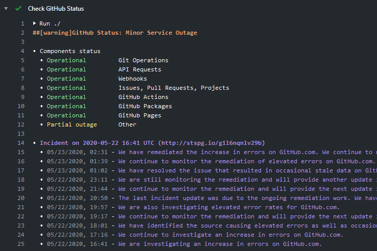

[](https://github.com/crazy-max/ghaction-github-status/releases/latest)
[](https://github.com/marketplace/actions/github-status)
[](https://github.com/crazy-max/ghaction-github-status/actions?workflow=test)
[](https://codecov.io/gh/crazy-max/ghaction-github-status)
[](https://github.com/sponsors/crazy-max)
[](https://www.paypal.me/crazyws)

## About

A GitHub Action to check [GitHub Status](https://www.githubstatus.com/) in your workflow.

If you are interested, [check out](https://git.io/Je09Y) my other :octocat: GitHub Actions!

___

* [Features](#features)
* [Usage](#usage)
  * [Basic workflow](#basic-workflow)
  * [Trigger error if GitHub services are down](#trigger-error-if-github-services-are-down)
* [Customizing](#customizing)
  * [inputs](#inputs)
* [Keep up-to-date with GitHub Dependabot](#keep-up-to-date-with-github-dependabot)
* [How can I help?](#how-can-i-help)
* [License](#license)

## Features

* Threshold management for each GitHub service or global (rollup)
* Display status of all services
* Display active incidents and updates

## Usage

### Basic workflow

The following workflow is purely informative and will only display the current status of GitHub services:


```yaml
name: build

on: push

jobs:
  build:
    runs-on: ubuntu-latest
    steps:
      -
        name: Check GitHub Status
        uses: crazy-max/ghaction-github-status@v1
      -
        name: Checkout
        uses: actions/checkout@v2
```

### Trigger error if GitHub services are down

In the example below we will set some status thresholds so that the job can fail if these thresholds are exceeded.

This can be useful if you have an action that publishes to GitHub Pages but the service is down.



```yaml
name: build

on: push

jobs:
  build:
    runs-on: ubuntu-latest
    steps:
      -
        name: Check GitHub Status
        uses: crazy-max/ghaction-github-status@v1
        with:
          overall_threshold: minor
          pages_threshold: partial_outage
      -
        name: Checkout
        uses: actions/checkout@v2
```

## Customizing

### inputs

Following inputs can be used as `step.with` keys

| Name                      | Type    | Description                                                                      |
|---------------------------|---------|----------------------------------------------------------------------------------|
| `overall_threshold`**¹**  | String  | Defines threshold for overall status (also called rollup) of GitHub to fail the job |
| `git_threshold`**²**      | String  | Defines threshold for Git Operations to fail the job                     |
| `api_threshold`**²**      | String  | Defines threshold for API Requests to fail the job                       |
| `webhooks_threshold`**²** | String  | Defines threshold for Webhooks to fail the job                           |
| `ipp_threshold`**²**      | String  | Defines threshold for Issues, PRs, Projects to fail the job              |
| `actions_threshold`**²**  | String  | Defines threshold for GitHub Actions to fail the job                     |
| `packages_threshold`**²** | String  | Defines threshold for GitHub Packages to fail the job                    |
| `pages_threshold`**²**    | String  | Defines threshold for GitHub Pages to fail the job                       |

> * **¹** Accepted values are `minor`, `major` or `critical`.
> * **²** Accepted values are `operational`, `degraded_performance`, `partial_outage` or `major_outage`.

## Keep up-to-date with GitHub Dependabot

Since [Dependabot](https://docs.github.com/en/github/administering-a-repository/keeping-your-actions-up-to-date-with-github-dependabot)
has [native GitHub Actions support](https://docs.github.com/en/github/administering-a-repository/configuration-options-for-dependency-updates#package-ecosystem),
to enable it on your GitHub repo all you need to do is add the `.github/dependabot.yml` file:

```yaml
version: 2
updates:
  # Maintain dependencies for GitHub Actions
  - package-ecosystem: "github-actions"
    directory: "/"
    schedule:
      interval: "daily"
```

## How can I help?

All kinds of contributions are welcome :raised_hands:! The most basic way to show your support is to star :star2: the project, or to raise issues :speech_balloon: You can also support this project by [**becoming a sponsor on GitHub**](https://github.com/sponsors/crazy-max) :clap: or by making a [Paypal donation](https://www.paypal.me/crazyws) to ensure this journey continues indefinitely! :rocket:

Thanks again for your support, it is much appreciated! :pray:

## License

MIT. See `LICENSE` for more details.
